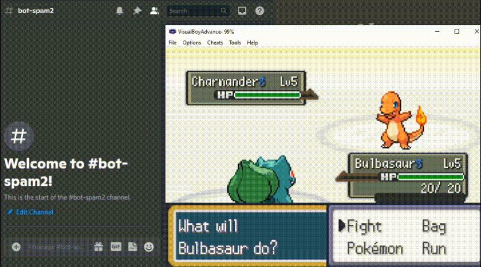

# Discord to Keyboard

A Discord Bot that will convert messages sent to a Discord message into keyboard inputs.

The bot will parse every message it sees and will press a button on the host's computer if a given message matches with a keyword (henceforth referred to as an 'alias')

An example mapping is as follows:

| Key | Alias |
| ------------- |-------------|
| Up Arrow      |   up |
| Down Arrow      |   down|
| Left Arrow      |   left|
| Right Arrow      |   right |
| z     |   a|
| x      |   b|
| Enter Key     |   enter|
| Backspace      |   select|

As an example, if the bot reads in a message that says "enter" it will press the Enter Key on the host's computer.

# Startup

1. On the command prompt, enter `pip install pyKey` and `pip install discord`
2. If you haven't already, create a new discord bot. Instructions are located at docs/Setting up a Discord Bot.pdf
3. Run run.bat
4. If you would like to edit the default key bindings / bot settings, you can do that by entering '2' or '3' respectively, otherwise, you can start the bot by entering '1'.
5. Enter the Bot Token when prompted.
6. Switch to an appropriate window.

### Known Issues

Turning off the bot with Ctrl + C while it is in the middle of pressing an uppercase letter may result in a "sticky shift" issue where the program was holding down the SHIFT Key but was turned off before it could release it.
This results in your keyboard acting as if the Shift key is held down, even if it isn't the case in reality. To fix the sticky shift issue, simply press the SHIFT key and release it.